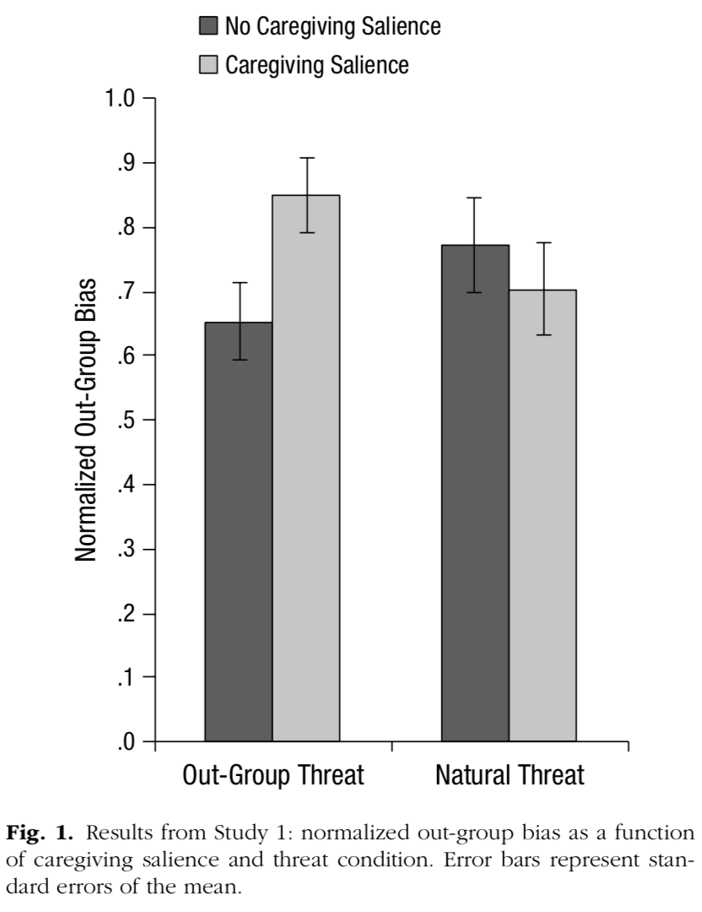

```{r}
articleID <- "10-7-2014_PS" # insert the article ID code here e.g., "10-3-2015_PS"
reportType <- 'final'
pilotNames <- "Jaclyn Schwartz, Drew Tysen Dauer, Erik Santoro" # insert the pilot's name here e.g., "Tom Hardwicke". If there are multiple pilots enter both names in a character string e.g., "Tom Hardwicke, Bob Dylan"
copilotNames <- "Ben Peloquin" # insert the co-pilot's name here e.g., "Michael Frank". If there are multiple co-pilots enter both names in a character string e.g., "Tom Hardwicke, Bob Dylan"
pilotTTC <- 420 # insert the pilot's estimated time to complete (in minutes, fine to approximate) e.g., 120
copilotTTC <- 180 # insert the co- pilot's estimated time to complete (in minutes, fine to approximate) e.g., 120
pilotStartDate <- as.Date("10/26/2017", format = "%m/%d/%y") # insert the pilot's start date in US format e.g., as.Date("01/25/18", format = "%m/%d/%y")
copilotStartDate <- as.Date("06/20/2018", format = "%m/%d/%y") # insert the co-pilot's start date in US format e.g., as.Date("01/25/18", format = "%m/%d/%y")
completionDate <- as.Date("06/20/2018", format = "%m/%d/%y") # copilot insert the date of final report completion (after any necessary rounds of author assistance) in US format e.g., as.Date("01/25/18", format = "%m/%d/%y")
```

-------

#### Methods summary
The aim of "Study 1" was to test if activating "caregiving motivation" would strengthen bias against out-groups. The authors recruited 300 participants (all Jewish mothers) to participate in an online study. `N = 300` were recruited with `75 participants per condition`. There were `4 condtions`. However, `14 were excluded`, leaving `N = 286`.
The 4 conditions were based on 2 manipulations: *caregiving-salience manipulation* (with 2 groups: caregiving-salience group and no-caregiving-salience group) and *out-group threat manipulation* (with 2 groups: out-group-threat condition and  natural-threat condition). Condition assignment was random and created by crossing the two caregiving-salience conditions with the two out-group-threat conditions. The DV of out-group bias was operationalized with an out-group bias questionnaire. The authors normalized the out-group `bias scores`, and then performed a `factorial ANOVA` with `caregiving` (caregiving salience vs. no caregiving salience) and `threat` (out-group threat vs. natural threat) as IVs, and `out-group bias` as the DV." After finding an interaction, simple effects analyses were performed.

------

#### Target outcomes
> The results showed a significant interaction between caregiving and threat, F(1, 282) = 4.220, p = .041, ηp2 = .014 (Fig. 1). Simple-effects analysis revealed that in the out-group-threat condition, participants who were primed for caregiving salience showed significantly higher levels of out-group bias (M = 0.851, SD = 0.528) than did the no-caregiving-salience group (M = 0.654, SD = 0.488), F(1, 282), p = .027, Cohen’s d = 0.387. In the natural-threat condition, there was no difference between participants in the caregiving-salience (M = 0.703, SD = 0.594) and no-caregiving-salience (M = 0.773, SD = 0.583) groups, F < 1. No further effects attained significance.

------

```{r global_options, include=FALSE}
knitr::opts_chunk$set(echo=TRUE, warning=FALSE, message=FALSE)
```

# Step 1: Load packages

```{r}
library(tidyverse) # for data munging
library(knitr) # for kable table formating
library(haven) # import and export 'SPSS', 'Stata' and 'SAS' Files
library(readxl) # import excel files
library(CARPSreports) # custom report functions
library(ggplot2)
library(ggthemes)
library(lsr)
```

```{r}
# Prepare report object. This will be updated automatically by the reproCheck function each time values are compared.
reportObject <- data.frame(dummyRow = TRUE, reportedValue = NA, obtainedValue = NA, valueType = NA, percentageError = NA, comparisonOutcome = NA, eyeballCheck = NA)
```

# Step 2: Load data

```{r}
caregiving_salience <- read_excel("data/caregiving_salience_paper_raw_data.xlsx", sheet = 1) %>%
  mutate(story=factor(story, levels=c("control", "caregiving")),  # for reproducing plots need this order
         tnaythreat=factor(tnaythreat, levels=c("threat", "control")))
head(caregiving_salience)
str(caregiving_salience)
```

# Step 3: Tidy data

```{r}
# the data was already in long format and the bias scores were already normalized
```

Check exclusions:

```{r exclusision}
cat('Exclusions not included in (Study 1 methods.)?:', nrow(caregiving_salience) == 300 - 14)
```

The exclusions have already been performed.

# Step 4: Run analysis

## Descriptive statistics

```{r summary-stats}
df_descriptives <- caregiving_salience %>%
  group_by(story, tnaythreat) %>%
  summarise(mean=mean(bias),
            sd=sd(bias))

kable(df_descriptives, caption="Descriptive stats")
```

```{r cache-report-check-descriptives}
res_descriptives <- data.frame()
descriptives_codes <- list(
  # outgroup threat
  c('0.851','threat', 'caregiving', 'mean'),
  c('0.528','threat', 'caregiving', 'sd'),
  c('0.654','threat', 'control', 'mean'),
  c('0.488','threat', 'control', 'sd'),
  # natural threat
  c('0.703','control', 'caregiving', 'mean'),
  c('0.594','control', 'caregiving', 'sd'),
  c('0.773','control', 'control', 'mean'),
  c('0.583','control', 'control', 'sd'))
  
  
for (i in 1:length(descriptives_codes)) {
  reported_stat <- descriptives_codes[[i]][1]
  tnaythreat_ <- descriptives_codes[[i]][2]
  story_ <- descriptives_codes[[i]][3]
  stat_type <- descriptives_codes[[i]][4]
  if (stat_type == 'mean') {
    reportObject <- reproCheck("reportedValue"=reported_stat, 
                             "obtainedValue"=df_descriptives %>% 
                               filter(tnaythreat==tnaythreat_, story==story_) %>% 
                               ungroup %>% 
                               select(mean) %>%
                               as.numeric(), 
                             "valueType"=stat_type)
  } else {
    reportObject <- reproCheck("reportedValue"=reported_stat, 
                             "obtainedValue"=df_descriptives %>% 
                               filter(tnaythreat==tnaythreat_, story==story_) %>% 
                               ungroup %>% 
                               select(sd) %>%
                               as.numeric(), 
                             "valueType"=stat_type)
  }
}
```


Reproducing fig1:

```{r reproduce-fig1}
caregiving_salience %>%
  group_by(story, tnaythreat) %>%
  summarise(mean_=mean(bias),
            sd_=sd(bias),
            n_=n(),
            se_= sd_ / sqrt(n_)) %>%
  ggplot(aes(x=tnaythreat, y=mean_, fill=story)) +
    geom_bar(stat='identity', position='dodge') +
    geom_errorbar(aes(ymin=mean_-se_, ymax=mean_+se_), position=position_dodge(.95), width=0.25) +
    labs(title="Outgroup Bias ratings by caregiving salience and threat condition", 
         y="normalized out-group bias", 
         x="threat condition ") + 
    ylim(0, 1) +
    theme_classic() +
    theme(plot.title = element_text(hjust = 0.5))
```



# Inferential statistics

ANOVA with caregiving (caregiving salience vs. no caregiving salience) and threat (out-group threat vs. natural threat) as independent variables and out-group bias as the dependent variable

```{r anova1}
aov_raw <- aov(bias ~ story * tnaythreat, data=caregiving_salience)
aov_summary <- summary(aov_raw)
``` 

```{r report-anova1}
reportObject <- reproCheck(reportedValue="4.220", obtainedValue=aov_summary[[1]]$`F value`[3], valueType="F")
reportObject <- reproCheck(reportedValue="0.041", obtainedValue=aov_summary[[1]]$`Pr(>F)`[3], valueType="p")
```

```{r etasq1}
eta_sq <- etaSquared(aov_raw , type=2, anova=TRUE)# Comparing partial eta squared
reportObject <- reproCheck(reportedValue = ".014", obtainedValue = eta_sq[7], valueType = 'pes') # MINOR NUMERICAL ERROR
```

```{r cohens-d}
cohendsD_threat <- caregiving_salience %>%
  filter(tnaythreat=="threat") %>%
  cohensD(x=bias~story, data=.)
```

```{r reproCheck-cohensD}
reportObject <- reproCheck(reportedValue="0.387", obtainedValue=cohendsD_threat, valueType="d")
```


```{r simple-effects-aov}
aov_summary_threat <- summary(aov(bias ~ story, data=subset(caregiving_salience, tnaythreat=='threat')))

# tom trying alternative anova implementation
library(afex)
aov.out <- aov_ez(data = subset(caregiving_salience, tnaythreat=='threat') %>% rownames_to_column("id"), id = "id", dv = "bias", between = "story")
# same result
# tom end


aov_summary_control <- summary(aov(bias ~ story, data=subset(caregiving_salience, tnaythreat=='control')))
```

```{r reproCheck-simple-effects-aov}

reportObject <- reproCheck(reportedValue=".027", obtainedValue=aov_summary_threat[[1]]$`Pr(>F)`[1], valueType="p")

reportObject <- reproCheck(reportedValue="<1.0", 
                           obtainedValue=aov_summary_control[[1]]$`F value`[1], 
                           valueType="F",
                           eyeballCheck=TRUE)
```

## Step 5: Conclusion

All the reported statistics from Experiment 1 were reproduced **except** in one case. 

> F(1, 282), p = .027

The degrees of freedom do not appear to be correct as there are 153 participants in this analysis. We also cannot reproduce the p-value (although there are no decision errors).


```{r}
Author_Assistance = FALSE # was author assistance provided? (if so, enter TRUE)

Insufficient_Information_Errors <- 0 # how many discrete insufficient information issues did you encounter?

# Assess the causal locus (discrete reproducibility issues) of any reproducibility errors. Note that there doesn't necessarily have to be a one-to-one correspondance between discrete reproducibility issues and reproducibility errors. For example, it could be that the original article neglects to mention that a Greenhouse-Geisser correct was applied to ANOVA outcomes. This might result in multiple reproducibility errors, but there is a single causal locus (discrete reproducibility issue).

locus_typo <- NA # how many discrete issues did you encounter that related to typographical errors?
locus_specification <- NA # how many discrete issues did you encounter that related to incomplete, incorrect, or unclear specification of the original analyses?
locus_analysis <- NA # how many discrete issues did you encounter that related to errors in the authors' original analyses?
locus_data <- NA # how many discrete issues did you encounter that related to errors in the data files shared by the authors?
locus_unidentified <- NA # how many discrete issues were there for which you could not identify the cause

Affects_Conclusion <- NA # Do any reproducibility issues encounter appear to affect the conclusions made in the original article? This is a subjective judgement, but you should taking into account multiple factors, such as the presence/absence of decision errors, the number of target outcomes that could not be reproduced, the type of outcomes that could or could not be reproduced, the difference in magnitude of effect sizes, and the predictions of the specific hypothesis under scrutiny.
```

```{r}
reportObject <- reportObject %>%
  filter(dummyRow == FALSE) %>% # remove the dummy row
  select(-dummyRow) %>% # remove dummy row designation
  mutate(articleID = articleID) %>% # add the articleID 
  select(articleID, everything()) # make articleID first column

# decide on final outcome
if(any(reportObject$comparisonOutcome != "MATCH") | Insufficient_Information_Errors > 0){
  finalOutcome <- "Failure without author assistance"
  if(Author_Assistance == T){
    finalOutcome <- "Failure despite author assistance"
  }
}else{
  finalOutcome <- "Success without author assistance"
  if(Author_Assistance == T){
    finalOutcome <- "Success with author assistance"
  }
}

# collate report extra details
reportExtras <- data.frame(articleID, pilotNames, copilotNames, pilotTTC, copilotTTC, pilotStartDate, copilotStartDate, completionDate, Author_Assistance, finalOutcome, Insufficient_Information_Errors, locus_typo, locus_specification, locus_analysis, locus_data, locus_unidentified)

# save report objects
if(reportType == "pilot"){
  write_csv(reportObject, "pilotReportDetailed.csv")
  write_csv(reportExtras, "pilotReportExtras.csv")
}

if(reportType == "final"){
  write_csv(reportObject, "finalReportDetailed.csv")
  write_csv(reportExtras, "finalReportExtras.csv")
}
```

# Session information

```{r session_info, include=TRUE, echo=TRUE, results='markup'}
devtools::session_info()
```

